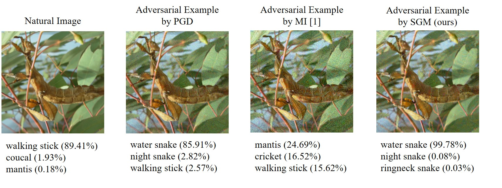

# Security of Skip-connections
 
This repository contains the code for [Rethinking the Security of Skip Connections in ResNet-like Neural Networks](https://openreview.net/forum?id=BJlRs34Fvr) (ICLR 2020 Spotlight).


## Method

## Requisite

This code is implemented in Pytorch, and has been in :

- torch = ?
- torchvision = ?
- advertorch = ?
- pretrainedmodels = ?

## Run the code

1. Select images which are **correctly classified** by source model
2. 
3. run the code
```
python attack_iter.py
```
4. evaluate the accuracy of target model in attacked images
```
python evaluate.py
```

## Results



## Implementation

